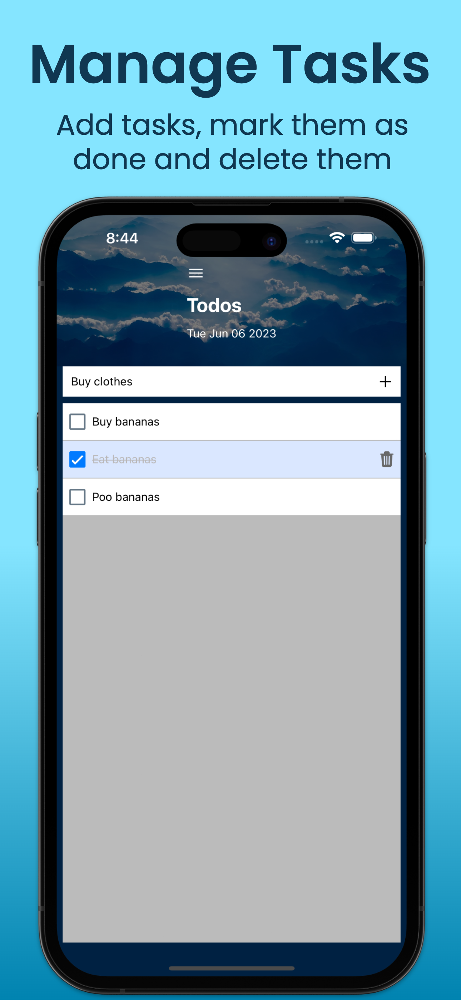
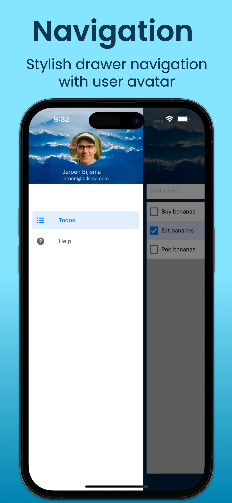

# React Native Apps in 30 minutes

Fully functional iOS / Android Todo App using React Native and Expo.

The idea (and UI) are based on the excellent "Make Apps with Danny" series created by Danny Connell:

https://www.youtube.com/watch?v=GV-D85D9KJQ&list=PLAiDzIdBfy8gNfGuDuAEBCgBLczNMAo0o&index=2

<p float="left" align="middle">
  
  
  
</p>

These App screenshots were made using Screenshots Pro (https://screenshots.pro/).

Features:

- Stylish custom header with image background
- Custom drawer with user avatar
- Safearea using useSafeAreaInsets from "react-native-safe-area-context"
- Drawer navigation to switch between Todos and Help screen
- Fully functional: add tasks, mark them as done and delete them
- Confirm deletion of tasks
- Toast after succesful deletion of task
- Tasks use react local state

# Good to know

For the drawer navigator to work add the react-native-reanimated/plugin plugin in babel.config.js:

```json
module.exports = function (api) {
  api.cache(true);
  return {
    ...
    plugins: ["react-native-reanimated/plugin"],
    ...
  };
};
```

Any changes to babel.config.js require a restart with clearing the cache:

```bash
npx expo start --clear
```

Issues:

- I notice some strange behaviour related to image scaling. Somehow you need to set both the width and height of an image. I would expect that setting one will be sufficient if you use a resizeMode that maintains the aspect ratio, but for some reason it does not work.
